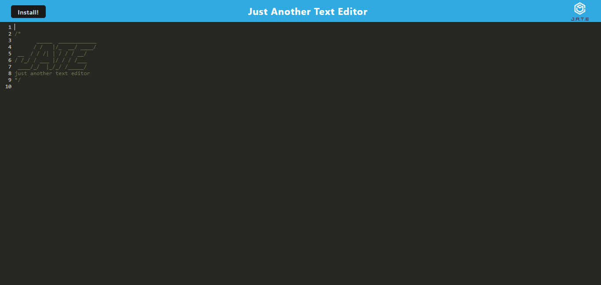

# Text Editor

## Table of Contents
- [Description](#description)
- [Visuals](#visuals)
- [Resources](#resources)

## Description
This application is a text editor PWA that is bundled together with webpack. It has the ability to be installed to your desktop if you wish, has offline functionality, cached assets and uses IndexedDB for database storage. 

## Visuals

## Usage
Upon loading the page the user can choose to install this application to their desktop by clicking the install button but the user does not need to install the application for it to work. The user can click on any line to add text, text is then save to the IndexedDB storage. If the user happens to be offline this application will still work as normal. 
## Resources
- [Live Site](https://obscure-taiga-07184.herokuapp.com/)
- [Repo](https://github.com/codytheroux96/text-editor)

